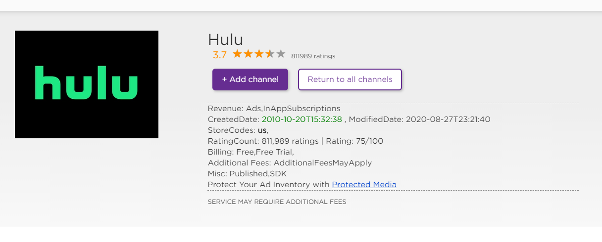
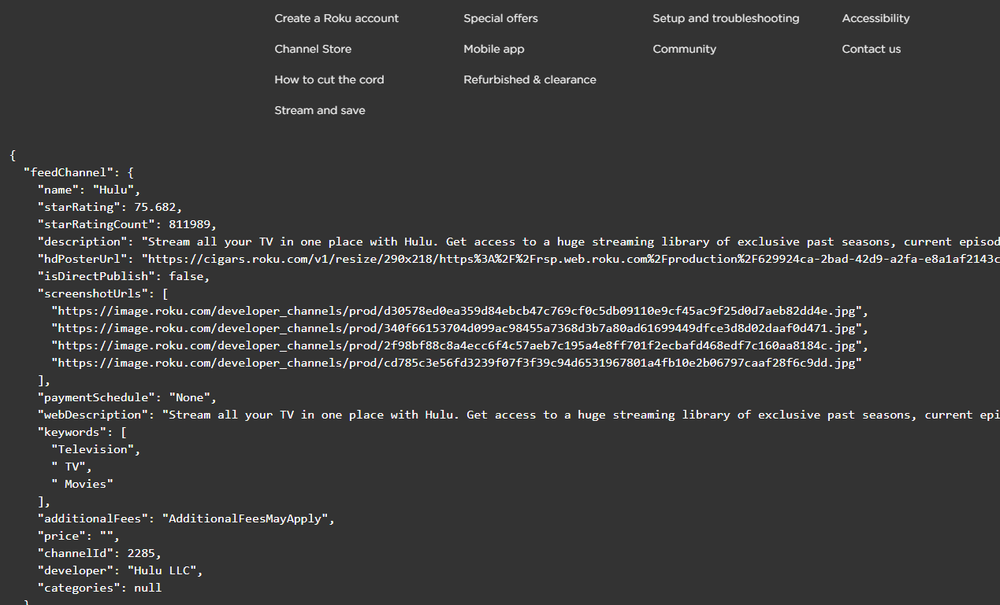

# RokuAdsExposed
Roku Ads Exposed GreaseMonkey/TamperMonkey Plugin

Just install TamperMoneky and add the RokuAdsExposed.js script ..
https://chrome.google.com/webstore/detail/tampermonkey/dhdgffkkebhmkfjojejmpbldmpobfkfo?hl=en

